# NECC Egg Price Dashboard - Architecture Overview

This document provides a comprehensive technical breakdown of the NECC Egg Price Dashboard application. It details the frontend architecture, backend data flow, forecasting engine logic, and deployment strategy.

## 1. System Overview

The application is a **Single Page Application (SPA)** built with React, served by a lightweight Node.js/Express backend (local) or Python Serverless Functions (Vercel Production). It fetches live egg price data from official NECC sources, visualizes it, and runs client-side forecasting algorithms.

```mermaid
graph TD
    User[User Browser]
    
    subgraph Frontend_React
        UI[App.jsx UI]
        Charts[Visualization Components]
        Forecast[Forecast Engine (JS)]
    end
    
    subgraph Backend_Infrastructure
        API_Route{/api/egg-prices}
        Server[Express Server (Local)]
        Serverless[Python Function (Vercel)]
        Scraper[HTML Parser (BeautifulSoup)]
    end
    
    subgraph External_Source
        NECC[e2necc.com (Official Data)]
    end

    User --> UI
    UI --> API_Route
    API_Route --> Server
    API_Route --> Serverless
    Server --> Scraper
    Serverless --> Scraper
    Scraper --> NECC
    
    UI --> Charts
    UI --> Forecast
    Forecast --> Charts
```

---

## 2. Frontend Architecture (React + Vite)

The frontend is built using **React** with **Vite** for fast bundling. It emphasizes performance and interactive data visualization without heavy external charting libraries.

### Component Hierarchy


### Key Modules
*   **`src/App.jsx`**: Main controller. Handles data fetching, state management for selected dates/cities, and orchestration of the forecasting flow.
*   **`src/utils/forecasting.js`**: Core analytical engine. Contains pure mathematical functions for time-series analysis.
*   **`src/components/Charts.jsx`**: Reusable SVG-based visualization components.

---

## 3. The Forecasting Engine (`src/utils/forecasting.js`)

The application features a robust **Client-Side Forecasting Engine**. It does not rely on backend ML services; instead, it processes data directly in the browser for instant feedback.

### Engine Logic Flow

```mermaid
sequenceDiagram
    participant App as App.jsx
    participant Engine as forecasting.js
    participant Model as Math Models

    App->>Engine: generateForecast(historicalData, days, modelType)
    
    Note over Engine: Pre-processing (Normalization)

    alt Model = 'seasonal'
        Engine->>Model: Decompose Seasonality + Trend
    else Model = 'wma' / 'ets'
        Engine->>Model: Apply Weighted Moving Avg / Exp. Smoothing
    end

    Model-->>Engine: Raw Predictions + Confidence Intervals
    
    Engine->>Engine: Calculate Metrics (R², Volatility, Trend Direction)
    
    Engine-->>App: { forecast[], metrics{} }
    App->>App: Update UI & Charts
```



### Supported Models
1.  **Seasonal Decomposition**: Identifies recurrent weekly/monthly patterns superimposed on a trend.
2.  **Weighted Moving Average (WMA)**: Give higher importance to recent data points.
3.  **Exponential Smoothing (ETS)**: Holt-Winters approach for trend following.

---

## 4. Backend & Data Layer

### Hybrid Architecture
The application supports two backend modes depending on the environment.

| Feature | Local Development | Vercel Production |
| :--- | :--- | :--- |
| **Server** | Node.js (Express) | Vercel Serverless (Python) |
| **Entry Point** | `server.js` | `api/egg-prices.py` |
| **Logic** | Cheerio / Axios | Requests / BeautifulSoup4 |
| **Route** | `http://localhost:3001/api/...` | `/api/egg-prices` |

### Data Pipeline
1.  **Request**: Frontend requests `/api/egg-prices?month=01&year=2026`.
2.  **Scrape**: Backend fetches HTML from specific NECC URL constructed from query params.
3.  **Parse**: HTML table is parsed to extract City, Price, and trend indicators.
4.  **Clean**: Data is sanitized (removing symbols, converting to numbers).
5.  **Serve**: JSON array is returned to Frontend.

---

## 5. Deployment Pipeline

The project uses a continuous deployment pipeline with GitHub and Vercel.


1.  **Push to GitHub**: Triggers webhook.
2.  **Vercel Build**:
    -   Installs Python dependencies (`requirements.txt`) for API.
    -   Builds React Frontend (`npm run build`).
3.  **Deploy**: 
    -   Static assets served from CDN.
    -   API functions deployed to AWS Lambda regions (via Vercel).
